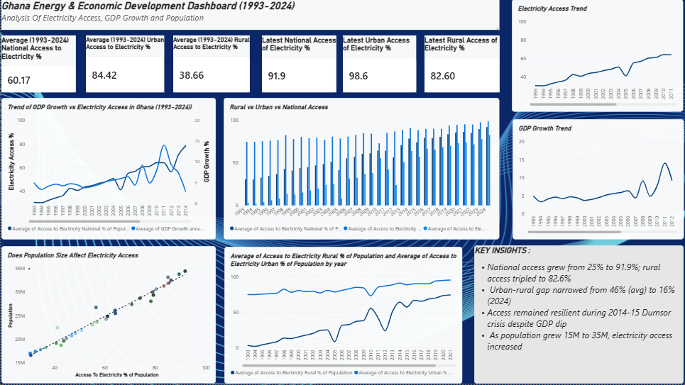

# Ghana Energy & Economic Development Analysis (1993-2024)

End-to-end analysis of electricity access, GDP growth, and population in Ghana using World Development Indicators (WDI) data.



### 📂 Data Source
World Development Indicators (WDI) - World Bank (1993-2024)

### 🛠️ Tools & Workflow

**1. Excel - Data Cleaning**
- Deleted unnecessary columns and rows
- Transposed data from rows to columns for proper analysis format
- Cleaned and formatted for 1993-2024 range

**2. SQL - Transformation**
- Dataset already contained total population
- Calculated year-on-year total population growth

```sql
SELECT *,
Population_total,(Population_total - LAG(Population_to
tal) OVER(ORDER BY year)) * 100 / LAG(Population_total) OVER(ORDER BY year) AS tot_pop_grt_pct
FROM electricity.peg;```
```

**3. Python - Analysis**
- Imported cleaned data using Pandas
- Calculated correlation between total population and electricity access

```python
import pandas as pd
electricity = pd.read_csv(r'C:\Users\JESSICA\Downloads\Electricity Access\pop_ele_gdp.csv')
print(electricity['acc_to_ele_pct_pop'].corr(electricity['pop_tot']))
```

**4. Power BI - Visualization**
- Built dashboard with KPIs, trends, and GDP vs Access analysis

``` Key Insights
- National access grew from 25% to 91.9% (Avg: 60.17%)
- Rural access: 38.66% avg → 82.6% in 2024
- Urban-rural gap narrowed from 46% to 16%
- Access remained resilient during 2014-15 Dumsor crisis
